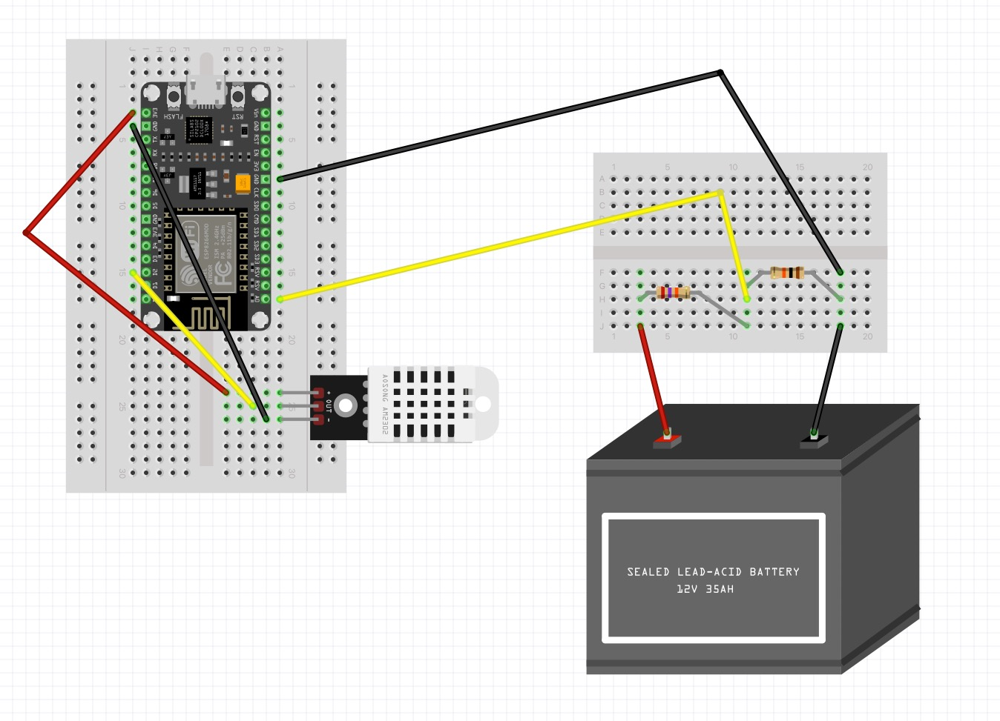

# Tinkur Humidity and Temp

## Overview

Project for measuring humidity and temperature using an HiLetgo ESP8266 NodeMCU and HiLetgo DHT22 sensor and send date to [Adafruit IO](https://io.adafruit.com/) to create a visual dashboard.

Adapted from:

- Adafruit [tutorial and code for ESP8266 Temperature / Humidity Webserver](https://learn.adafruit.com/esp8266-temperature-slash-humidity-webserver/wiring).
- [Tutorial for measuring 12v battery voltage using an ESP8266](https://www.engineersgarage.com/nodemcu-battery-voltage-monitor/) and https://www.youtube.com/watch?v=m5jasXwLQa4&ab_channel=HamedAdefuwa

## TODO

[ ] Try 47k resistor vs 27k to lower max voltage enough and work with this math
[ ] Try 3.2v factor vs 5v factor since the board runs at 3.x volts

## Hardware

- [HiLetgo ESP8266 NodeMCU](https://www.amazon.com/gp/product/B010O1G1ES/)
- [HiLetgo DHT22 Humidity + Temp with breakout board](https://www.amazon.com/gp/product/B0795F19W6/) or AM2302 or DHT22 (note: if using a DHT22 without a breakout board, you'll need a 10k resistor [more info](https://learn.adafruit.com/esp8266-temperature-slash-humidity-webserver/wiring))
- power supply, usb cable, hookup supplies

## Wiring

See [Fritzing](https://fritzing.org/) design in `/fritzing` directory.



## Setup

The following assumes OSX:

1. Download and install the [Arduino IDE](https://www.arduino.cc/en/Main/Software)

2. Download and install the [CP210x USB to UART Bridge VCP Drivers](https://www.silabs.com/products/development-tools/software/usb-to-uart-bridge-vcp-drivers) so the USB chipset on the NodeMCU can communicate with your computer

3. Clone this repo from GitHub to your computer

4. Create an [Adafruit IO](https://io.adafruit.com/) account to store your data and create a dashboard of your data

5. Open `/main/temphumidityadafruitio/` in the Arduino IDE and create a 'secrets.h' file

Create a 'secrets.h' file in the Sketch's root directory (ex. /main/temphumidityadafruitio/) with the following contents:

```
#define WLAN_SSID       "WiFiSSID"
#define WLAN_PASS       "WiFiPassword"

#define AIO_HUM_FEED   "/feeds/garage-humidity"
#define AIO_TEMP_FEED  "/feeds/garage-temperature"
#define AIO_MOISTURE_FEED  "/feeds/garage-moisture"
#define AIO_SERVER      "io.adafruit.com"
#define AIO_SERVERPORT  1883
#define AIO_USERNAME    "AdafruitIOUsername"
#define AIO_KEY         "AdafruitIOKey"
```

The 'secrets.h' file is ignored by Git.

6. [Install support](https://learn.adafruit.com/add-boards-arduino-v164/) for NodeMCU boards in the Arduino IDE.

7. Download and install Arduino libraries needed by this project.

- Install ESP8266 [custom boards](https://arduino-esp8266.readthedocs.io/en/latest/installing.html)
- https://github.com/adafruit/DHT-sensor-library
- https://github.com/adafruit/Adafruit_Sensor
- https://github.com/adafruit/Adafruit_MQTT_Library

See [Arduino IDE library tutorial](https://learn.adafruit.com/adafruit-all-about-arduino-libraries-install-use/arduino-libraries) if needed.

8. Setup Arduino IDE under Tools menu:

- Board: NodeMCU 1.0 (ESP=12E Module)
- CPU Frequency: 80MHz
- Flash Size: 4M (3M SPIFFS)
- Upload Speed: 115200
- Port: SLAB_USBtoUART (or similar)

9. Wire NodeMCU and DHT22:

- DHT22 "-" to NodeMCU "GND"
- DHT22 "+" to NodeMCU "3.3v"
- DHT22 "out" to NodeMCU "D2"

10. Plug in the board via USB via the Apple USB A to C adapter (don't use a USB hub)

11. Compile and Upload Sketch in Arduino IDE

12. Use Arduino IDE terminal to debug at 115200 baud

## Resources

- [ESP8266 Pinouts](https://randomnerdtutorials.com/esp8266-pinout-reference-gpios/)
